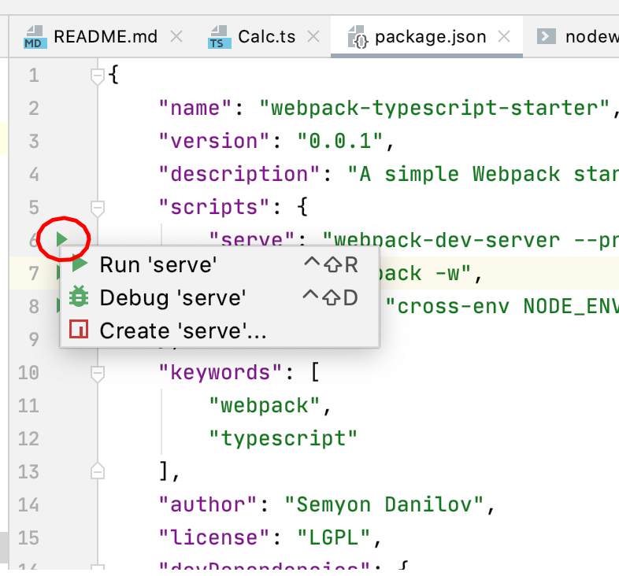
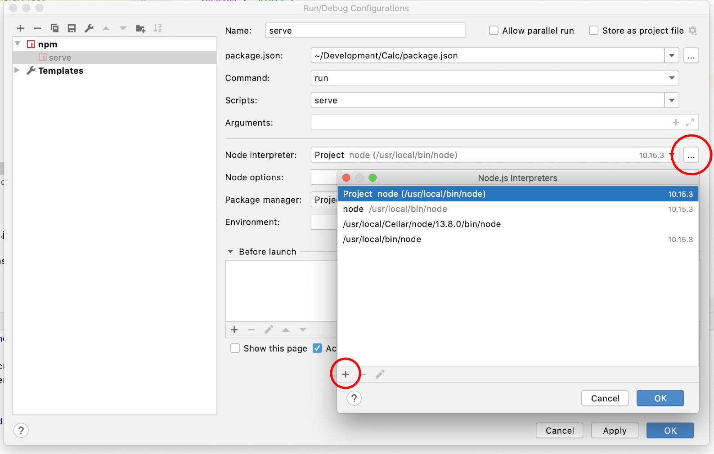

### Установка nodejs

1. В корне проекта из терминала вызовите `./npmw install` (Linux, MacOS) / `powershell.exe -noprofile -executionpolicy bypass -file .\npmw.ps1 install` (Windows)
1. Укажите путь к nodejs в среде разработки:
Откройте package.json и выберите зелёный треугольник напротив желаемого NPM скрипта (например, "serve")
  
Добавьте nodejs из папки bin, появившейся в проекте после выполнения `install` на первом шаге
  


### NPM скрипты 

Для Windows используйте `powershell.exe -noprofile -executionpolicy bypass -file .\npmw.ps1` вместо `./npmw`, e.g.:
`powershell.exe -noprofile -executionpolicy bypass -file .\npmw.ps1 test`

```
# Запуск тестов
$ ./npmw run test

# Запуск примера
$ ./npmw run example
```
